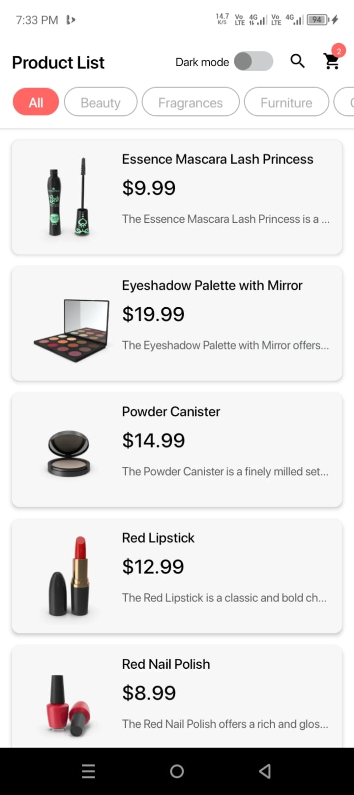
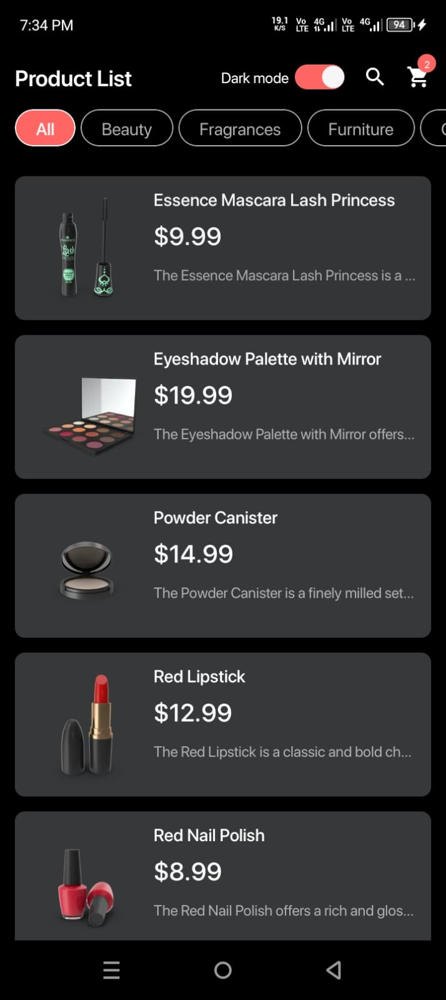
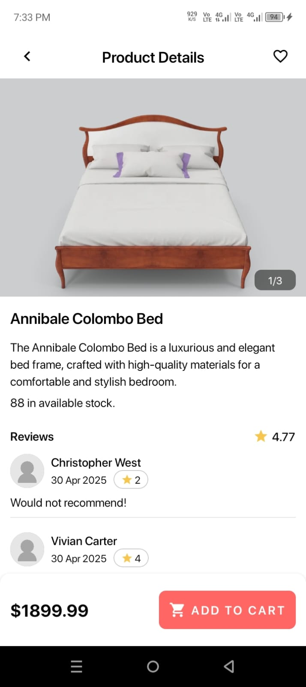
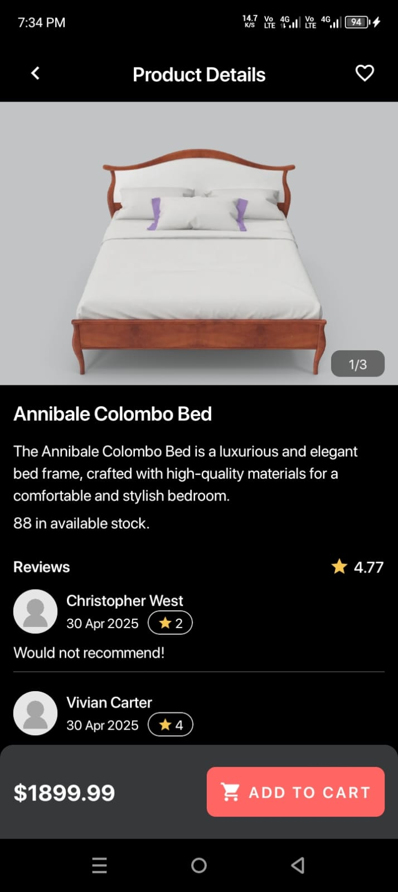
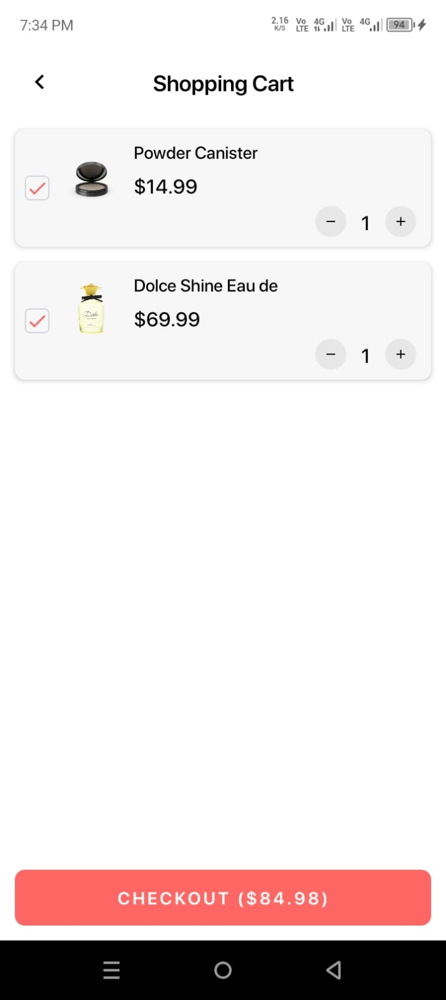
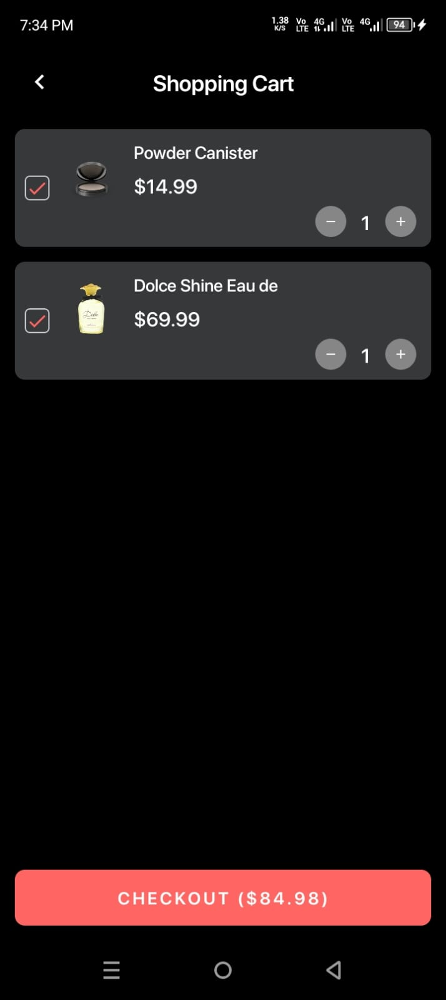

# Productmoe for React Native Test

## Screenshots

<table>
  <tr>
    <td>Product List</td>
    <td>Product List Dark Mode</td>
    <td>Product Details</td>
    <td>Product Details Dark Mode</td>
    <td>Shopping Cart</td>
    <td>Shopping Card Dark Mode</td>
  </tr>
  <tr>
    <td></td>
    <td></td>
    <td></td>
    <td></td>
    <td></td>
    <td></td>
  </tr>
 </table>

## APK Release

https://github.com/abdoerrahiem/rn_productmoe/tree/main/app-release.apk
